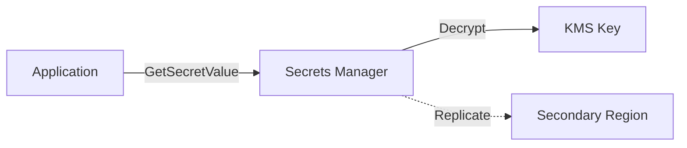
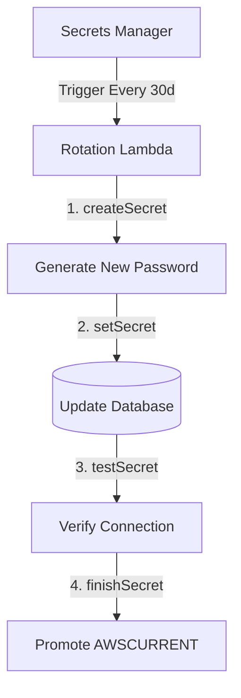

# Terraform AWS Secrets Manager Module

> **A production-ready, security-first Terraform module for managing AWS Secrets Manager with built-in rotation, KMS encryption, and multi-region replication.**

[](https://www.terraform.io/)
[](https://aws.amazon.com/secrets-manager/)

---

## 🎯 Overview

This module simplifies AWS Secrets Manager operations while maintaining enterprise-grade security and compliance standards. Built for infrastructure teams who need a secure, maintainable solution without the complexity of managing Lambda rotation functions, KMS keys, and IAM policies separately.

### Key Features

- ✅ **Automatic Secret Rotation** with built-in Lambda function (optional)
- ✅ **KMS Encryption** with Customer Managed Keys (GDPR/SOC2 compliant)
- ✅ **Multi-Region Replication** for disaster recovery
- ✅ **VPC Support** for private database rotation
- ✅ **Least Privilege IAM** policies scoped to specific secrets
- ✅ **Lifecycle Protection** to prevent accidental overwrites
- ✅ **Zero External Dependencies** - Lambda code bundled with module

---

## 🚀 Quick Start

### Basic Secret (No Rotation)

```hcl
module "app_config" {
  source = "./modules/aws-secrets"
  
  secret_name = "prod/app/config"
  secret_value = jsonencode({
    api_key = "your-api-key"
  })
  
  tags = {
    Environment = "production"
  }
}
```

### Database Secret with Rotation

```hcl
module "database_credentials" {
  source = "./modules/aws-secrets"
  
  secret_name = "prod/db/credentials"
  
  # Enable KMS encryption (GDPR/SOC2)
  create_kms_key = true
  
  # Enable automatic rotation
  enable_rotation        = true
  create_rotation_lambda = true  # Lambda created automatically
  rotation_days          = 30
  
  secret_value = jsonencode({
    username = "admin"
    password = random_password.db.result
    host     = "db.example.com"
    port     = 5432
    dbname   = "production"
  })
}
```

### Multi-Region Secret with DR

```hcl
module "global_secret" {
  source = "./modules/aws-secrets"
  
  secret_name      = "prod/global/api-key"
  create_kms_key   = true
  replica_regions  = ["us-west-2", "eu-west-1"]
  
  secret_value = var.api_key
}
```

---

## 🏗️ Architecture

### Design Philosophy

I chose a **unified module approach** over separate modules for rotating/non-rotating secrets:

**Why?**
- ✅ **Less Boilerplate:** Single flag (`enable_rotation = true`) vs managing separate modules
- ✅ **No Duplication:** Shared encryption, IAM, and lifecycle logic
- ✅ **Easier Maintenance:** One codebase to update, test, and version
- ✅ **Better UX:** Feature flags are more intuitive than module selection

### Standard Secret Flow



### Rotated Secret Flow (4-Step Process)



---

## 📖 Usage Examples

### Example 1: Basic Secret (No Rotation)

**Use Case:** Store application configuration, API keys, or static credentials.

```bash
cd environments/secret-without-rotation
terraform init
terraform apply
```

**Creates:**
- Secret with AWS-managed encryption (free)
- 30-day recovery window
- Simple JSON credentials

### Example 2: Production Database with Rotation

**Use Case:** RDS/PostgreSQL credentials with automatic 30-day rotation.

```bash
cd environments/secret-rotation
terraform init
terraform apply
```

**Creates:**
- Secret with Customer Managed KMS key
- Lambda rotation function (Python 3.11)
- IAM roles with least privilege
- S3 backend for state management

---

## 🔐 Security Features

### 1. Encryption

| Option | Use Case | Cost |
|--------|----------|------|
| **AWS-Managed Key** (default) | Development, non-sensitive | Free |
| **Customer Managed Key** | Production, , audit trails | $1/month + $0.03/10k requests |

**GDPR Compliance:** Custom KMS keys satisfy GDPR Article 32 requirements for encryption at rest with customer-controlled keys.

### 2. IAM Least Privilege

Rotation Lambda permissions are scoped to:
- ✅ **Specific Secret ARN** (not `Resource: "*"`)
- ✅ **KMS decrypt** only via Secrets Manager service (`kms:ViaService`)
- ✅ **CloudWatch Logs** for audit trails

### 3. Lifecycle Protection

```hcl
lifecycle {
  # Prevents Terraform from overwriting rotated values
  ignore_changes = [secret_string, secret_binary]
  
  # Prevents accidental deletion (enable in production)
  prevent_destroy = true
}
```

---

## 📝 Module Variables

### Required Inputs

| Variable | Type | Description |
|----------|------|-------------|
| `secret_name` | `string` | Unique secret identifier (max 512 chars) |

### Optional Inputs (Security)

| Variable | Type | Default | Description |
|----------|------|---------|-------------|
| `create_kms_key` | `bool` | `false` | Create Customer Managed KMS key (GDPR/SOC2) |
| `kms_key_id` | `string` | `null` | Use existing KMS key ARN |
| `kms_deletion_window` | `number` | `30` | KMS key deletion window (7-30 days) |

### Optional Inputs (Rotation)

| Variable | Type | Default | Description |
|----------|------|---------|-------------|
| `enable_rotation` | `bool` | `false` | Enable automatic secret rotation |
| `create_rotation_lambda` | `bool` | `true` | Create Lambda function (or use external) |
| `rotation_days` | `number` | `30` | Days between automatic rotations |
| `rotation_vpc_config` | `object` | `null` | VPC config for private database access |

### Optional Inputs (Replication & Recovery)

| Variable | Type | Default | Description |
|----------|------|---------|-------------|
| `replica_regions` | `list(string)` | `[]` | AWS regions for multi-region replication |
| `recovery_window_days` | `number` | `30` | Days before permanent deletion (7-30) |

**Full variable documentation:** See [`modules/aws-secrets/variables.tf`](./modules/aws-secrets/variables.tf)

---

## 📤 Module Outputs

| Output | Description | Usage |
|--------|-------------|-------|
| `secret_arn` | Secret ARN | Use in IAM policies, GetSecretValue API |
| `kms_key_arn` | KMS key ARN (if created) | Cross-account key policies |

---

## 🔄 Secret Rotation Implementation

### How It Works

This module implements AWS's recommended 4-step rotation process:

1. **createSecret** - Generate new credentials using cryptographically secure randomness
2. **setSecret** - Update the database with new credentials
3. **testSecret** - Verify new credentials work
4. **finishSecret** - Promote new version to `AWSCURRENT`

### Lambda Function Features

- ✅ **Python 3.11** runtime
- ✅ **Cryptographic-grade** password generation (`secrets` module)
- ✅ **VPC Support** for private databases
- ✅ **Version Management** (AWSCURRENT, AWSPENDING, AWSPREVIOUS)
- ✅ **Error Handling** for each rotation step

### Database-Specific Rotation (Future Enhancement)

The current implementation uses a **generic rotation template**. For production databases, you would extend the Lambda function to support:

- **RDS MySQL:** `ALTER USER 'username'@'%' IDENTIFIED BY 'new_password'`
- **RDS PostgreSQL:** `ALTER USER username WITH PASSWORD 'new_password'`
- **DocumentDB:** MongoDB-style user updates
- **Aurora:** Master/reader credential handling

**Implementation notes:** See TODOs in [`modules/aws-secrets/rotation.tf`](./modules/aws-secrets/rotation.tf) lines 127-132

---

## 🧪 Testing the Module

### Manual Testing

```bash
# 1. Deploy the test environment
cd environments/secret-without-rotation
terraform init && terraform apply

# 2. Retrieve secret value
aws secretsmanager get-secret-value \
  --secret-id test/basic-secret \
  --query SecretString \
  --output text | jq .

# 3. Test rotation (if enabled)
aws secretsmanager rotate-secret \
  --secret-id test/basic-secret

# 4. Cleanup
terraform destroy
```

### Automated Testing (Future Enhancement)

For production use, add:
- **Terratest** integration tests
- **Rotation simulation** tests
- **Multi-region replication** verification

---

## 🚀 Production Deployment Checklist

Before deploying to production:

- [ ] **Enable KMS encryption:** Set `create_kms_key = true`
- [ ] **Configure S3 backend:** Use remote state with DynamoDB locking
- [ ] **Set prevent_destroy:** Uncomment `prevent_destroy = true` in `main.tf`
- [ ] **Configure VPC:** Set `rotation_vpc_config` if database is in private subnet
- [ ] **Add CloudWatch alarms:** Monitor rotation failures (see TODOs)
- [ ] **Test rotation:** Manually trigger rotation before enabling schedule
- [ ] **Document secrets:** Maintain inventory of secrets and rotation schedules

---

## 🔮 Future Enhancements

This module demonstrates core functionality. Enterprise-ready additions would include:

### 1. Cross-Account Access

```hcl
# Allow another AWS account to read secrets
resource "aws_secretsmanager_secret_policy" "cross_account" {
  secret_arn = module.secret.secret_arn
  policy = jsonencode({
    Statement = [{
      Effect = "Allow"
      Principal = { AWS = "arn:aws:iam::999999999:root" }
      Action = ["secretsmanager:GetSecretValue"]
      Resource = "*"
    }]
  })
}
```

### 2. CloudWatch Monitoring

```hcl
# Alert on rotation failures
resource "aws_cloudwatch_metric_alarm" "rotation_failed" {
  alarm_name = "secret-rotation-failed"
  metric_name = "RotationFailed"
  namespace = "AWS/SecretsManager"
  # ... configuration
}
```

### 3. Drift Detection

- Tag compliance monitoring
- Replication status verification
- KMS key rotation status

### 4. Database-Specific Rotators

- Separate Lambda functions for MySQL, PostgreSQL, DocumentDB
- Connection pooling awareness
- Master vs replica credential updates

**Note:** These are documented as TODOs throughout the codebase.

---

## 📁 Project Structure

```
terraform-aws-secrets/
├── README.md                          # This file
├── modules/
│   └── aws-secrets/                   # Main module
│       ├── main.tf                    # Secret resource, replication
│       ├── rotation.tf                # Lambda rotation function
│       ├── kms.tf                     # KMS encryption
│       ├── variables.tf               # Input variables (validated)
│       ├── outputs.tf                 # Module outputs
│       ├── versions.tf                # Provider requirements
│       └── README.md                  # Module documentation
├── environments/
│   ├── secret-without-rotation/       # Basic example
│   └── secret-rotation/               # Production example with KMS + rotation
└── examples/
    └── secrets_client.py              # Python SDK usage example
```

---

## 🛠️ Requirements

| Tool | Version | Purpose |
|------|---------|---------|
| **Terraform** | >= 1.3.0 | Infrastructure as Code |
| **AWS Provider** | >= 4.0 | AWS resource management |
| **AWS CLI** | >= 2.0 | Testing and validation |

---

## 🤝 Best Practices Implemented

1. ✅ **Input Validation:** All variables have validation rules and error messages
2. ✅ **Least Privilege IAM:** Policies scoped to specific resources
3. ✅ **Encryption by Default:** KMS support for sensitive secrets
4. ✅ **Lifecycle Management:** Recovery windows, ignore_changes for rotation
5. ✅ **DRY Principle:** Single module with feature flags vs duplication
6. ✅ **Documentation:** Inline comments explain "why" not just "what"
7. ✅ **Production Awareness:** S3 backend, state locking, cost documentation

---

## 💡 Design Decisions & Trade-offs

### Why Single Module vs Separate Modules?

**Considered Alternatives:**
- Option A: `secret-basic` + `secret-rotated` separate modules
- Option B: Single module with `enable_rotation` flag ✅

**Decision:** Single module with feature flags

**Rationale:**
- ✅ Less code duplication (KMS, IAM, replication shared)
- ✅ Better developer UX (one import, simple flags)
- ✅ Easier testing (one module to validate)
- ⚠️ Trade-off: Slightly more complex conditionals in code

### Why Bundled Lambda vs External?

**Decision:** Module can create Lambda OR use external ARN

**Rationale:**
- ✅ Quick start: `create_rotation_lambda = true` (zero config)
- ✅ Flexibility: Use existing Lambda if needed
- ✅ Production-ready: Full 4-step rotation implementation included

---

## 📚 References

- [AWS Secrets Manager Rotation](https://docs.aws.amazon.com/secretsmanager/latest/userguide/rotating-secrets.html)
- [GDPR Article 32 - Security of Processing](https://gdpr-info.eu/art-32-gdpr/)
- [Terraform Module Best Practices](https://www.terraform.io/language/modules/develop)

---

## 👤 Author

**Bhuvaneshwari Chinnadurai**  
February 2026

---